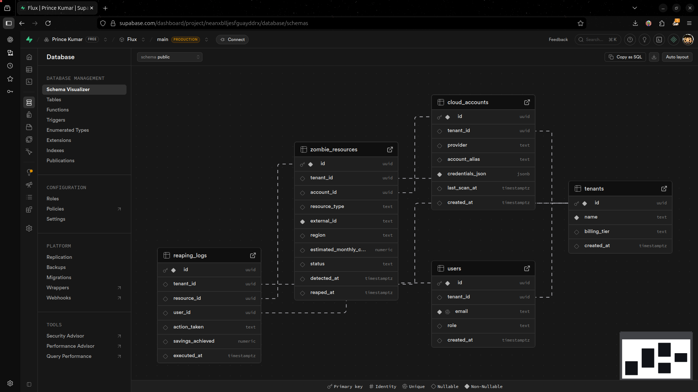

# GreenOps Reaper 🌬️
### Cut the Bloat, Keep the Scale.

**GreenOps Reaper** (also known as **Flux**) is an automated cloud efficiency platform designed to identify, report, and "reap" idle or over-provisioned cloud resources. It helps organizations reduce their cloud bill and carbon footprint by ensuring every dollar spent on infrastructure provides actual value.



## 🚀 Key Features

*   **Zombie Resource Detection**: Automatically identifies "zombie" resources such as:
    *   Unattached EBS volumes.
    *   Idle EC2 instances with low CPU/Network utilization.
    *   Unused Elastic Load Balancers (ELBs).
    *   Dangling Elastic IPs.
*   **Multi-Region Scanning**: Scan your AWS infrastructure across multiple regions simultaneously.
*   **Automated Email Reports**: Receive periodic summaries of potential savings and identified waste directly in your inbox.
*   **Secure Authentication**: Integrated with Google and GitHub OAuth for seamless, secure access.
*   **Cost Estimation**: Get real-time estimates of how much each idle resource is costing you per month.
*   **Actionable Insights**: A clear dashboard to manage your cloud accounts and take action on findings.
*   **Multi-tenant Architecture**: Designed as a SaaS with subscription plans and scan credits.

## 🛠️ Tech Stack

*   **Monorepo Strategy**: Managed with [Turborepo](https://turbo.build/repo).
*   **Frontend**: React (Vite) with a custom design system built on Vanilla CSS.
*   **Backend**: Node.js & Express.
*   **Database**: PostgreSQL hosted on [Neon](https://neon.tech/).
*   **Cloud Integration**: AWS SDK v3 (EC2, CloudWatch, ELB, STS).
*   **Authentication**: Passport.js (Google & GitHub Strategies).
*   **Automation**: Node-Cron for scheduled infrastructure audits.
*   **Mail**: Nodemailer for automated reporting.

## 📦 Project Structure

```text
.
├── apps
│   ├── api          # Express.js Backend
│   └── web          # React (Vite) Frontend
├── packages
│   ├── ui           # Shared UI Component Library
│   ├── eslint-config # Shared ESLint configurations
│   └── typescript-config # Shared TSConfigs
└── turbo.json       # Turborepo configuration
```

## ⚙️ Getting Started

### Prerequisites

*   [Node.js](https://nodejs.org/) (v18+)
*   [npm](https://www.npmjs.com/) or [pnpm](https://pnpm.io/)
*   An [AWS Account](https://aws.amazon.com/) with a ReadOnlyAccess policy (or custom policy for reaping).
*   A [Neon](https://neon.tech/) or PostgreSQL database.

### Installation

1.  **Clone the repository**:
    ```bash
    git clone https://github.com/Prince1895/Flux.git
    cd greenops-reaper
    ```

2.  **Install dependencies**:
    ```bash
    npm install
    ```

3.  **Environment Setup**:
    Create a `.env` file in `apps/api/` with the following variables:
    ```env
    DATABASE_URL=your_postgres_connection_string
    JWT_SECRET=your_jwt_secret
    GOOGLE_CLIENT_ID=...
    GOOGLE_CLIENT_SECRET=...
    GITHUB_CLIENT_ID=...
    GITHUB_CLIENT_SECRET=...
    AWS_ACCESS_KEY_ID=...
    AWS_SECRET_ACCESS_KEY=...
    SMTP_HOST=...
    SMTP_PORT=...
    SMTP_USER=...
    SMTP_PASS=...
    FRONTEND_URL=http://localhost:5173
    BACKEND_URL=http://localhost:4000
    ```

4.  **Database Migration**:
    The schema is automatically applied on boot when running the API. You can also manually apply `apps/api/schema.sql`.

### Development

Run all applications in development mode:

```bash
npm run dev
```

The frontend will be available at `http://localhost:5173` and the API at `http://localhost:4000`.

## 🚢 Deployment

The project is optimized for deployment on **Vercel** or any Node.js compatible environment.

*   The `web` app is a static Vite build.
*   The `api` app is a standard Node.js server.

## 📜 License

This project is licensed under the ISC License.
